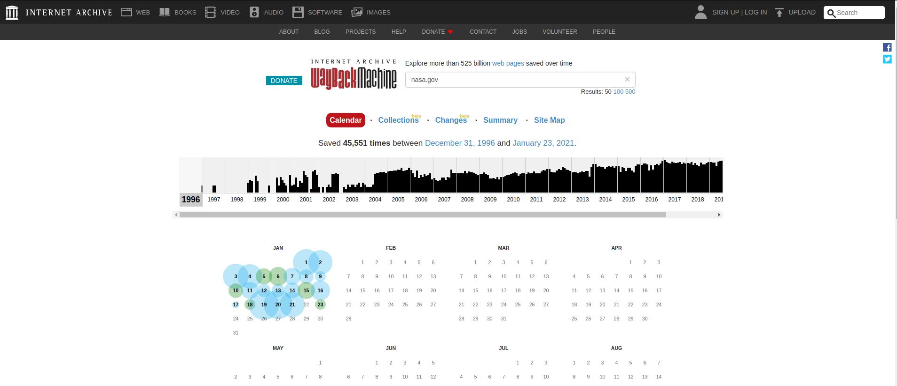
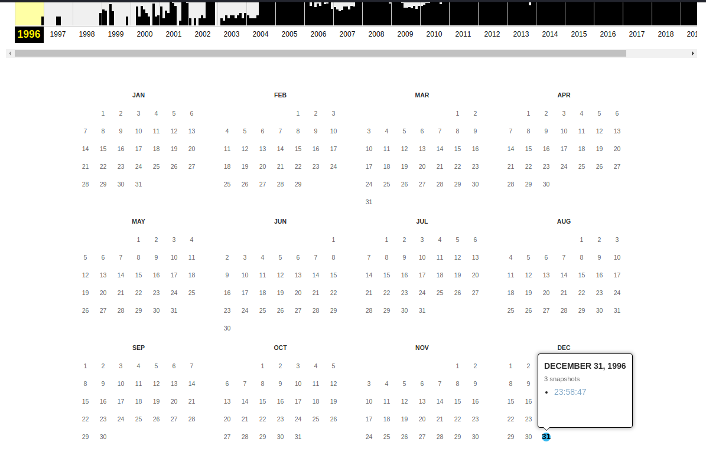
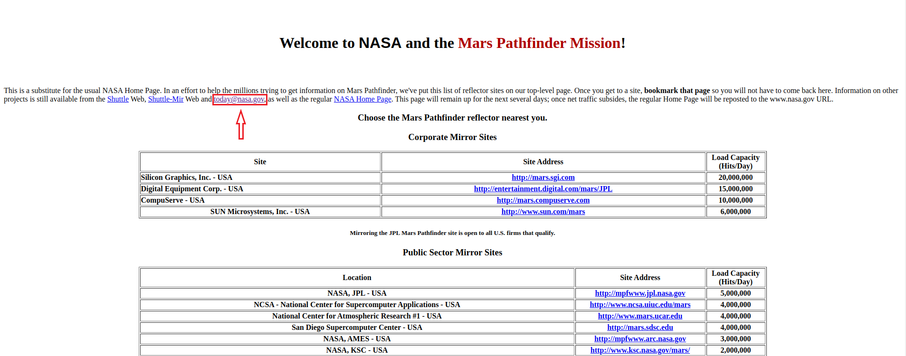

## Time Traveller
The main idea of finding the flag is using Web Archive.

#### Step-1:
Let's take a trip to nasa.gov on December 31, 1996. If you can tell me what email NASA listed on their website, I'll provide you with 10 points.

From the description, its clear that we have to access the [Web Archive](http://web.archive.org/) here.
#### Step-2:
So, I visited the given date: December 31, 1996 for [nasa.gov](nasa.gov) website. It was accessible here: http://web.archive.org/web/19961231235847/http://www.nasa.gov/

#### Step-3:
Clearly, we can see the flag there.

#### Step-4:
Finally, the flag becomes: 
`today@nasa.gov`