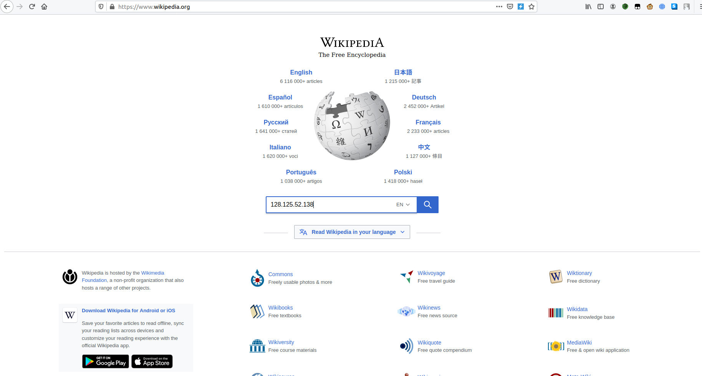
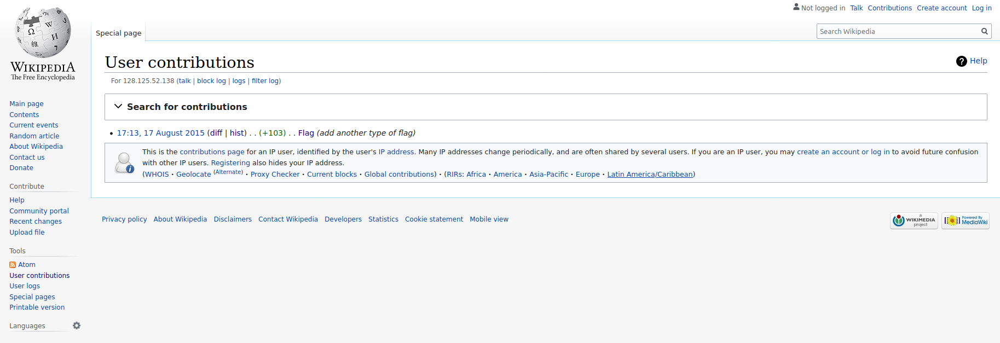

## Wikipedia
The main idea finding the flag is explore more from the question.

#### Step-1:
First of all, I tried directly searching for the given IP Address, but that path led to nowhere. So next, I went to https://www.wikipedia.org/ to get answers. I tried to search given IP Address to search their database.

#### Step-2:
Upon searching the given domain, I get this search result, so I try to check up some links there.

#### Step-3:

When I tried the first link of https://en.wikipedia.org/w/index.php?title=Flag&diff=prev&oldid=676540540,
I got the flag there:

#### Step-4:
Finally the flag becomes:
`CTFlearn{cNi76bV2IVERlh97hP}`
