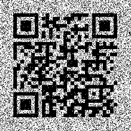

## An Old Image
The main idea finding the flag using PIL library of image processing.

#### Step-1:
We are given `old_image.png` which is as follows:


#### Step-2:
The given image has the columns mixed. So, we basically iterate through the columns to replace all the contrasting pixels back to `255, 255, 255`. The script `exploit.py` can be used to proceed.

```py
#!/bin/python3
from PIL import Image

old_img = Image.open('old_image.png')
oldPixelLoad = old_img.load()

img = Image.new(mode = "RGB", size = (old_img.width, old_img.height), color = (255, 255, 255))
pixelLoad = img.load()

for x in range(old_img.width):
	for y in range(old_img.height):
		a = x
		b = y
		c = oldPixelLoad[x, y][0]
		d = oldPixelLoad[x, y][1]

		if a + b > 255:
			pixelLoad[c, d] = (255, 255, 255)
		else:
			pixelLoad[c, d] = (0, 0, 0)

img.save("new_image.png")
img.show()
```

#### Step-3:
After executing the above script, we get a new image called `new_image.png` which is as follows:



#### Step-4:
The image is then scanned using an online tool called [Aspose](https://products.aspose.app/barcode/recognize) which decodes the QR code and gives out the flag.


#### Step-5:
Finally the flag becomes:
`CTFlearn{how_can_swapping_columns_hide_a_qr_code}`