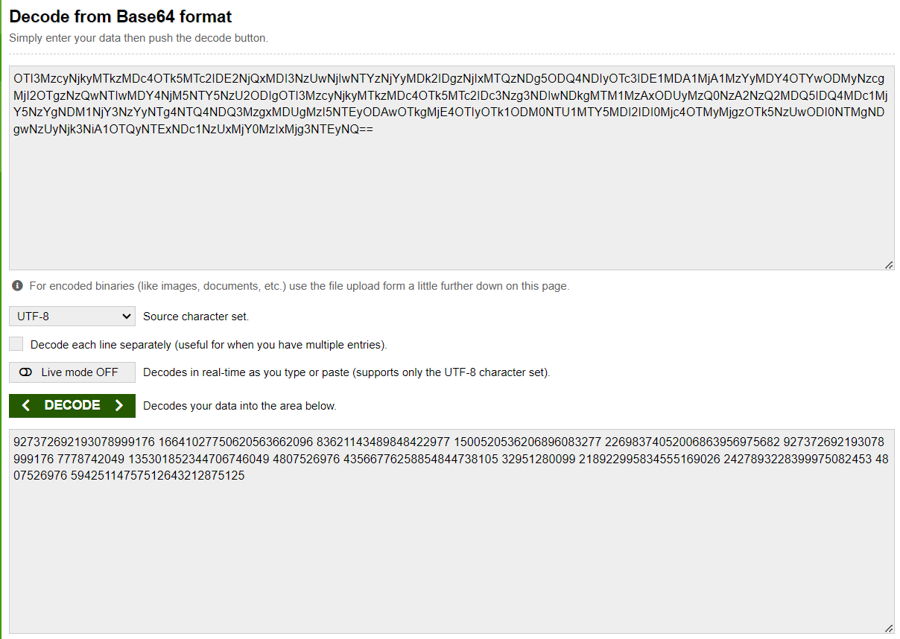
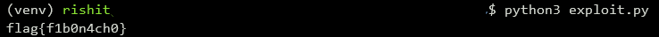

## Fabio's Nachos
The main idea finding the flag analyzing the Fibonacci Sequence.

#### Step-1:
After we download `base.txt` from the cloud, we try to understand what is the content. Decoding it online, we get:



#### Step-2:
By finding the value of the sequence through this website: https://www.math.net/list-of-fibonacci-numbers, we can come up with simple exploit `exploit.py` which looks like as follows:

```py
#!/usr/bin/env python3
import base64
from Cryptodome.Util import number

def find_fibonacci_index(values):
    ma = max(values)

    w = [0] * 100
    w[0] = 1
    w[1] = 1
    i = 2
    n = 0
    seq = [-1] * len(values)
    while n < ma:
        n = w[(i-1)%100] + w[(i-2)%100]
        w[i % 100] = n
        try:
            loc = -1
            while True:
                loc = values.index(n, loc+1, len(values)) 
                seq[loc] = i+1
        except ValueError:
            pass
        finally:
            i += 1
    return seq

buffer = open('base.txt', 'rb').read()
values = base64.b64decode(buffer).split()
values = list(map(int, values))
seq = find_fibonacci_index(values)
print(seq)
print(''.join(map(chr, seq)))
```

#### Step-3:
The following `exploit.py` can be executed using the command `python3 exploit.py`, we get the flag as follows:



#### Step-4:
Finally the flag becomes:
`flag{f1b0n4ch0}`