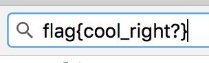

## Image Magic
The main idea finding the flag is get flag using PIL from Python.

#### Step-1:
After I downloaded `out copy.jpg`, it is clearly stretched. All we need to do is to set the pixel and realign.


#### Step-2:

So, I wrote `Exploit.py` with the help of PIL to get our flag.

```python
from PIL import Image

# Specs from old pic
im = Image.open('out copy.jpg')
pix_val = list(im.getdata())
splited = [pix_val[i::92] for i in range(92)]

# Defining new pic
h, w = 92, 304
new_im = Image.new("RGB",(w, h))
pix = new_im.load()

# Setting height and pixels
for y in range(h):
    line = splited[y]
    for x in range(w):
        r, g, b = line[x]
        pix[x, y] = (r, g, b)

# New Image
new_im.save("Flag.jpg", "JPEG")
```

#### Step-3:
After running this as `python3 Exploit.py`, I got the flag.



#### Step-4:
Finally the flag becomes: 
`flag{cool_right?}`