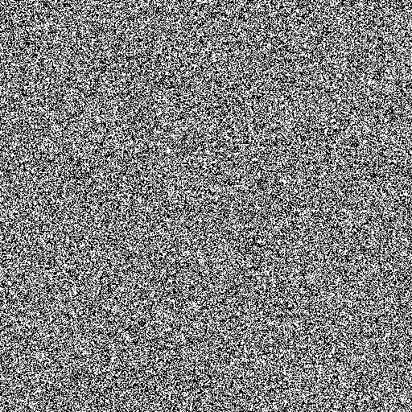
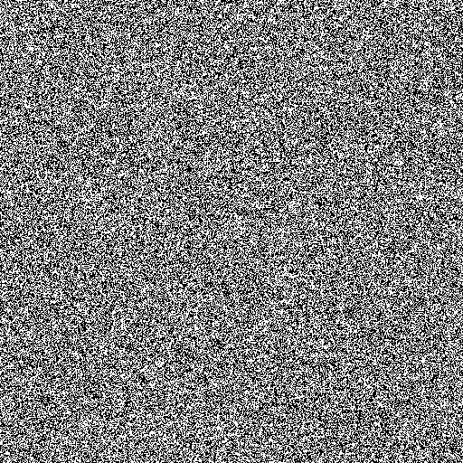
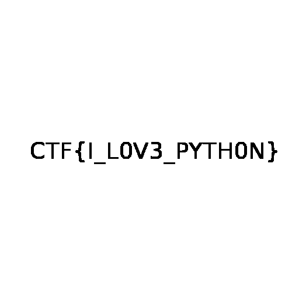

## Old memories

#### Step-1:
After downloading `hisss.zip`, I got 2 images `1.png` & `2.png` in it.





#### Step-2:
Now if we zoom in we see it some pixels manipulation done. So, I wrote a script `exploit.py` to get the flag.

```python
from PIL import Image

i1 = Image.open("1.png")
i2 = Image.open("2.png")

pixels = 512

pix1 = i1.load()
pix2 = i2.load()

for i in range(pixels):
	for j in range(pixels):
		if pix1[i,j] == pix2[i,j]:
			pix1[i,j] = 0
		else:
			pix1[i,j] = 255
		
i1.save("flag.png")
```

#### Step-3:
After I ran this as `python3 exploit.py`, I got this image `flag.png` which had flag in it.




#### Step-4:
Finally, the flag becomes:
`CTF{I_L0V3_PYTH0N}`