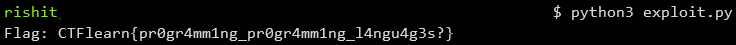

## Programming a language
The main idea finding the flag using the instructions mentioned in the challenge.

#### Step-1:
After we download `input.txt` from the cloud, we see the following:
```
++++++++++++++++++++++++++++++++++++++++++++++++.++++++++++++++++++++++++++++++++++++++++++++++++++++++++++++++++.++.----------->@>>.<@<<<.@<@<@<++++<.<@<@<<@<-----.<<<<<.<@<@<+<.+>@.-------.-------->>>.<@<@<++++++++++++++++++++++++++++++++++++++++++++++++++++++++++++++++.++>>>.<@<@<<.-----------<.>@>@<@><<.>@>@++++<.>@-----.>>>.<@<@<+<.>@+.-------.--------.+++++++++++++>>>>>>.<@<@<@<@<@<<.>@++.-------<.>@+++++++<<<.>@>@>@<<.>@>@<.>@-<.>@++++++++++++<<<.>@>@>@+++++++++++€
```

#### Step-2:
Based on instructions mentioned in the challenge, we can write up a script `exploit.py` which is as follows:

```python
#!/usr/bin/env python3

s = "++++++++++++++++++++++++++++++++++++++++++++++++.++++++++++++++++++++++++++++++++++++++++++++++++++++++++++++++++.++.----------->@>>.<@<<<.@<@<@<++++<.<@<@<<@<-----.<<<<<.<@<@<+<.+>@.-------.-------->>>.<@<@<++++++++++++++++++++++++++++++++++++++++++++++++++++++++++++++++.++>>>.<@<@<<.-----------<.>@>@<@><<.>@>@++++<.>@-----.>>>.<@<@<+<.>@+.-------.--------.+++++++++++++>>>>>>.<@<@<@<@<@<<.>@++.-------<.>@+++++++<<<.>@>@>@<<.>@>@<.>@-<.>@++++++++++++<<<.>@>@>@+++++++++++€"

values = [0]

for a in s:
	if a == '+':
		values[-1] += 1
	elif a == '-':
		values[-1] -= 1
	elif a == '<':
		x = [values[-1]]
		x.extend(values[:-1])
		values = x
	elif a == '@':
		values[-1], values[-2] = values[-2], values[-1]
	elif a == '>':
		values.append(values[0])
		values = values[1:]
	elif a == '.':
		values.append(values[-1])
	else: # a == '€':
		#print(''.join(map(chr, values)))
		flag = ''.join(map(chr, values))
		print("Flag: CTFlearn{" + flag + "}")
```

#### Step-3:
We then execute the script using the command: `python3 exploit.py`



#### Step-4:
Finally the flag becomes:
`CTFlearn{pr0gr4mm1ng_pr0gr4mm1ng_l4ngu4g3s?}`
