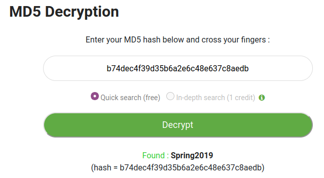

## The Credit Card Fraudster
The main idea of finding the flag is Bruteforce the strings.

#### Step-1:
I generally use APK Decompiling tools, but this was easy, so I just decompiled it online [here](http://www.javadecompilers.com/apk).

I started to look for MainActivity.java file. I got it at location:
sources/com/example/secondapp/MainActivity.java

#### Step-2:
MainActivity.java had this:

```java
package com.example.secondapp;

import android.os.Bundle;
import android.view.View;
import android.widget.EditText;
import android.widget.TextView;
import androidx.appcompat.app.AppCompatActivity;
import org.apache.commons.codec.digest.DigestUtils;

public class MainActivity extends AppCompatActivity {
    /* access modifiers changed from: protected */
    public void onCreate(Bundle bundle) {
        super.onCreate(bundle);
        setContentView((int) C0272R.layout.activity_main);
    }

    public void submitPassword(View view) {
        EditText editText = (EditText) findViewById(C0272R.C0274id.editText2);
        if (DigestUtils.md5Hex(editText.getText().toString()).equalsIgnoreCase("b74dec4f39d35b6a2e6c48e637c8aedb")) {
            TextView textView = (TextView) findViewById(C0272R.C0274id.textView);
            StringBuilder sb = new StringBuilder();
            sb.append("Success! CTFlearn{");
            sb.append(editText.getText().toString());
            sb.append("_is_not_secure!}");
            textView.setText(sb.toString());
        }
    }
}
```


#### Step-3:
This flag has 3 parts. We basically need to reverse the given hash.

```
b74dec4f39d35b6a2e6c48e637c8aedb
```

#### Step-4:
I did it online at: https://www.md5online.org/md5-decrypt.html [Thanks to comments]



#### Step-5:
Finally, the flag becomes: 
`CTFlearn{Spring2019_is_not_secure!}`
