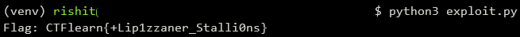

## Ramada
The main idea finding the flag using the decompiler to understand main function.

#### Step-1:
After we download `Ramada.zip` from the cloud, we see there are 4 files namely `Ramada`, `readme`, `reversing`, `sources.zip.enc` where `Ramada`is the main executable which is to be reversed.

#### Step-2:
When we decompile the executable `Ramada` using [Ghidra](https://ghidra-sre.org/), we see that the function `CheckFlag` has revealed how the program check the input string. We try to mimic each steps on possible characters to find out the flag.
```c
undefined8 CheckFlag(char *param_1)
{
  long i;
  int iVar1;
  
  i = 0;
  do {
    iVar1 = (int)param_1[i];
    if (*(int *)(data + i * 4) != iVar1 * iVar1 * iVar1) {
      puts("No flag for you!");
      return 4;
    }
    i = i + 1;
  } while (i != 0x15);
  return 0;
}
```
#### Step-3:
We see that the `data` array is initialized as following.
```c
void InitData(void)
{
  data._0_4_ = 0x13693;
  data._4_4_ = 0x6b2c0;
  data._8_4_ = 0x13693;
  data._12_4_ = 0x6b2c0;
  data._16_4_ = 0x1cb91;
  data._20_4_ = 0x1bb528;
  data._24_4_ = 0x1cb91;
  data._28_4_ = 0x1bb528;
  data._32_4_ = 0x144f38;
  data._36_4_ = 0xfb89d;
  data._40_4_ = 0x144f38;
  data._44_4_ = 0xfb89d;
  data._48_4_ = 0x8b98b;
  data._52_4_ = 0x17d140;
  data._56_4_ = 0x8b98b;
  data._60_4_ = 0x17d140;
  data._64_4_ = 0x1338c0;
  data._68_4_ = 0x11a9f9;
  data._72_4_ = 0x1338c0;
  data._76_4_ = 0x11a9f9;
  data._80_4_ = 0x1734eb;
  return;
}
```
In order to find out the actual array at runtime we need to run it in [gdb](https://www.sourceware.org/gdb/) and dump that region of memory which is as follows:

```bash
gef➤  x/21gx $rsi
0x555555558040 <data>:          0x0006b2c000013693      0x001570000011a9f9
0x555555558050 <data+16>:       0x001bb5280001cb91      0x000ded21001bb528
0x555555558060 <data+32>:       0x000fb89d00144f38      0x000d151f00169b48
0x555555558070 <data+48>:       0x0017d1400008b98b      0x001338c0000ded21
0x555555558080 <data+64>:       0x0011a9f9001338c0      0x00144f380001b000
0x555555558090 <data+80>:       0x00000000001734eb      0x0000000000000000
```
#### Step-4:
In order to bruteforce these possibilities, we write a script `exploit.py` to get the flag which is as follows:

```python
import numpy as np

data = [0x13693, 0x6b2c0, 0x11a9f9, 0x157000, 0x1cb91, 0x1bb528, 0x1bb528, 0xded21, 0x144f38, 0xfb89d, 0x169b48, 0xd151f, 0x8b98b, 0x17d140, 0xded21, 0x1338c0, 0x1338c0, 0x11a9f9, 0x1b000, 0x144f38, 0x1734eb]

flag = ""

for d in data:
	i = round(np.cbrt(d))
	flag += chr(i)
	
print("Flag: CTFlearn{" + flag + "}")
```

#### Step-5:
We then execute the script using the command: `python3 exploit.py`



#### Step-6:
Finally the flag becomes:
`CTFlearn{+Lip1zzaner_Stalli0ns}`