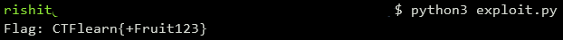

## Raspberry
The main idea finding the flag using the decompiler to understand main function.

#### Step-1:
After we download `Raspberry.zip` from the cloud, we see there are 3 files namely `Raspberry`, `readme`, `sources.zip.enc` where `Raspberry`is the main executable which is to be reversed.

#### Step-2:

After getting the program inside [gdb](https://www.sourceware.org/gdb/) and checking the assembly code, we see that there are different labels of same structure `_FirstLetter`, `_SecondLetter` and so on. In total there are 19 letters or characters in the flag. We know that flag starts with `CTFlearn{`.

#### Step-4:
For each character in the input string, the program performs kind of manipulations using `add`, `sub`, `mul`, `div`, `shl` instructions. In order to reverse this operation, we can write a simple script `exploit.py` as follows:

```python
import subprocess
import string

output_len = 156
flag = '' 

for i in range(19):
    for c in string.printable:
        out, _ = subprocess.Popen(
            ['./Raspberry', (flag+c).ljust(19, string.printable[-1])], stdout = subprocess.PIPE).communicate()
        if len(out) != output_len:
            output_len = len(out)
            flag += c
            break
print("Flag: " + flag)
```

#### Step-5:
We execute the above script by using the command `python3 exploit.py` to get the flag as follows:



#### Step-6:
Finally the flag becomes:
`CTFlearn{+Fruit123}`