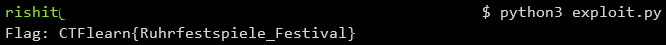

## Recklinghausen
The main idea finding the flag using the decompiler to understand main function.

#### Step-1:
After we download `Recklinghausen.zip` from the cloud, we see there are 3 files namely `Recklinghausen`, `readme`,`sources.zip.enc` where `Recklinghausen`is the main executable which is to be reversed.

#### Step-2:
When we decompile the executable `Recklinghausen` using [Ghidra](https://ghidra-sre.org/), we see that the function `CheckMsg` XOR the input string with `msg5` array, the result is supposed to be equal to `msg[i+2]`.
```c
undefined8 CheckMsg(char *param_1)

{
  size_t sVar1;
  long i;
  
  sVar1 = strlen(param_1);
  if ((ulong)(uint)msg5[0] != sVar1) {
    return 0;
  }
  if (msg5[0] != 0) {
    i = 0;
    do {
      if (msg5[i + 2] != (byte)(param_1[i] ^ msg5[1])) {
        return 0;
      }
      i = i + 1;
    } while ((int)i < (int)(uint)msg5[0]);
  }
  return 1;
}
```
#### Step-3:
So we XOR `msg5[i]` and `msg5[i+2]` to find out value at corresponding position of input string. The `msg5` array could be obtained from any decompiler.

#### Step-4:
In order to bruteforce these possibilities, we write a script `exploit.py` to get the flag which is as follows:

```python
#!/usr/bin/env python3

def bytes_to_array(dat, sz):
    dat = dat.split()
    arr = []
    for i in range(0, len(dat), sz):
        arr.append(int(''.join(reversed(dat[i:i+sz])), 16))
    return arr

msg5 = "21 7e 3d 2a 38 12 1b 1f 0c 10 05 2c 0b 16 0c 18 1b 0d 0a 0d 0e 17 1b 12 1b 21 38 1b 0d 0a 17 08 1f 12 03"
msg5 = bytes_to_array(msg5, 1)

def uncheck():
    buf = [0]*msg5[0]

    if msg5[0] != 0:
        for i in range(msg5[0]):
            buf[i] = msg5[i+2] ^ msg5[1]
    return buf

buf = uncheck()
flag = ''.join(map(chr, buf))
print("Flag: " + flag + "}")
```

#### Step-5:
We then execute the script using the command: `python3 exploit.py`



#### Step-6:
Finally the flag becomes:
`CTFlearn{Ruhrfestspiele_Festival}`