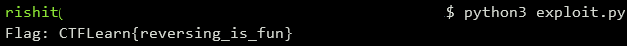

## Reverse Me
The main idea finding the flag using the decompiler to understand main function.

#### Step-1:
After we download `reverseme` from the cloud, we decompile the executable `reverseme` using [Ghidra](https://ghidra-sre.org/).

#### Step-2:
The program takes 26 bytes of input to encrypt and shuffle it to get another 26 bytes of output, the correct input would make the output match the array `expected`.
```c
  printf("Enter flag [CTFlearn{ ... }]: ");
  __edflag = (int)register0x00000020 + -0x38;
  __isoc99_scanf(&DAT_00100b87);
  encrypt(local_38,__edflag);
  lVar1 = shuffle(extraout_RAX);
  i = 0;
  do {
    if (0x19 < i) {
      puts("Correct!");
LAB_00100abf:
      if (canary != *(long *)(in_FS_OFFSET + 0x28)) {
                    /* WARNING: Subroutine does not return */
        __stack_chk_fail();
      }
      return 0;
    }
    if (expected[i] != *(char *)(lVar1 + i)) {
      puts("Incorrect");
      goto LAB_00100abf;
    }
    i = i + 1;
  } while( true );
```
#### Step-3:
First we unshuffle the expected array. `uVar2` variable is not so clear, but `uVar2` is used to access buffer starts at `local_48`. We then decrypt the unshuffle result to get the input.

#### Step-4:
In order to bruteforce these possibilities, we write a script `exploit.py` to get the flag which is as follows:

```python
#!/usr/bin/env python3

expected = [0] * 26
expected[0] = ord('W')
expected[1] = 0x42
expected[2] = 0x4b
expected[3] = 0x45
expected[4] = 0xcc
expected[5] = 0xbb
expected[6] = 0x81
expected[7] = 0xcc
expected[8] = 0x71
expected[9] = 0x7a
expected[10] = 0x71
expected[11] = 0x66
expected[12] = 0xdf
expected[13] = 0xbb
expected[14] = 0x86
expected[15] = 0xcd
expected[16] = 100
expected[17] = 0x6f
expected[18] = 0x6e
expected[19] = 0x5c
expected[20] = 0xf2
expected[21] = 0xad
expected[22] = 0x9a
expected[23] = 0xd8
expected[24] = 0x7e
expected[25] = 0x6f

def unshuffle(param):
    buf = [0] * len(param)

    for i in range(0, len(param)-1, 2):
        buf[i+1] = param[i]

    for i in range(1, len(param), 2):
        buf[i-1] = param[i]

    return buf

def decrypt(block):
    local_48 = [1, 3, 3, 7, 0xde, 0xad, 0xbe, 0xef]
    buf = [0] * len(block)
    ind = 0

    for i in range(len(block)):
        buf[i] = block[i] ^ local_48[ind]
        ind = (ind+1) % len(local_48)
    return buf

buf = unshuffle(expected)
buf = decrypt(buf)
flag = ''.join(map(chr, buf))

print("Flag: " + flag)
```

#### Step-5:
We then execute the script using the command: `python3 exploit.py`



#### Step-6:
Finally the flag becomes:
`CTFLearn{reversing_is_fun}`
