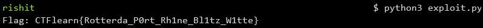

## Rotterdam Reversing Challenge
The main idea finding the flag using the decompiler to understand main function.

#### Step-1:
After we download `Rotterdam_1.zip` from the cloud, we see there are 3 files namely `Rotterdam`, `readme`, `sources.zip.enc` where `Rotterdam`is the main executable which is to be reversed.

#### Step-2:
When we decompile the executable `Rotterdam` using [Ghidra](https://ghidra-sre.org/), we see that the function `CheckFlag` has revealed how the program check the input string. We try to mimic each steps on possible characters to find out the flag. In the `Rotterdam.asm` extracted from the decompiler, we get the following:

```asm
     │ │    0x0040117e      498b00         mov rax, qword [r8]
     │ │    0x00401181      4831c3         xor rbx, rax
     │ │    0x00401184      48b8569ad581.  movabs rax, 0x4b227ff781d59a56
     │ │    0x0040118e      4839d8         cmp rax, rbx
     │ │    0x00401191      0f856b030000   jne loc._BadFlag
```
In `rax` is the first 8 bytes of kernel, the the expected result of XORing `rax` and `rbx` is `0x4b227ff781d59a56`. So value in `rbx` is calculated previously, it seems like a input free value. A simple way to get the value would be run in debugger, break at specific point and read the value. `rbx` value is `0x2a460d92f5a1f504`, so here is the first part, `Rotterda`. Similarly, all the other part values are also calculated and joined with `_` delimiter. 

#### Step-3:
In order to bruteforce these possibilities, we write a script `exploit.py` to get the flag which is as follows:
```python
#!/usr/bin/env python3
prefix = 'CTFlearn{'
kernel = []

s = hex(0x2a460d92f5a1f504^0x4b227ff781d59a56)[2:]
param = ''.join(reversed(''.join(map(chr, [int(s[i:i+2],16) for i in range(0,len(s),2)]))))
kernel.append(param)

s = hex(0x15764ff46 - (0x4f7fb8ade2f2cef6&0xffffffff))[2:]
param = ''.join(reversed(''.join(map(chr, [int(s[i:i+2],16) for i in range(0,len(s),2)]))))
kernel.append(param)

s = hex(0x4d998c32ff+0x17d4a53553)[2:]
param = ''.join(reversed(''.join(map(chr, [int(s[i:i+2],16) for i in range(0,len(s),2)]))))
kernel.append(param)

s = hex(0x6a8754493837f7d400a77b9be//0xdeb4fa4d998c32ff)[2:]
param = ''.join(reversed(''.join(map(chr, [int(s[i:i+2],16) for i in range(0,len(s),2)]))))
param = 'B' + param
kernel.append(param)

s = "6574743157"
param = ''.join(reversed(''.join(map(chr, [int(s[i:i+2],16) for i in range(0,len(s),2)]))))
kernel.append(param)
flag = '_'.join(kernel)

print("Flag: CTFlearn{" + flag + '}')
```

#### Step-4:
We then execute the script using the command: `python3 exploit.py`



#### Step-5:
Finally the flag becomes:
`CTFlearn{Rotterda_P0rt_Rh1ne_Bl1tz_W1tte}`
