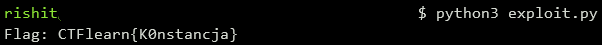

## Rzeszow
The main idea finding the flag using the decompiler to understand main function.

#### Step-1:
After we download `Rzeszow.zip` from the cloud, we see there are 4 files namely `Rzeszow`, `readme`, `reversing`, `sources.zip.enc` where `Rzeszow`is the main executable which is to be reversed.

#### Step-2:
When we decompile the executable `Rzeszow` using [Ghidra](https://ghidra-sre.org/), we see that the function `CheckFlag` has revealed how the program check the input string. We try to mimic each steps on possible characters to find out the flag.

#### Step-3:
In order to bruteforce these possibilities, we write a script `exploit.py` to get the flag which is as follows:
```python
flag_comp = 'abcdefghijklmnopqrstuvwxyzABCDEFGHIJKLMNOPQRSTUVWXYZ0123456789!@#$%^&*()_+-=<>,.?/{}[]\|~'
kernelenc = "W8Hj?1VESL^g4xwcvtW%humtEosd$Fq^dXPvi$#sSEe@o618Zl9.5PFrvC%O_E*LB%Igl8qur9SuLAp4MkK#pRzwJHI*Fn9mUs%mGK^RQKO.G*JFJvV%?VJpCpVF9eJuz5&kB!&_VF5DrF?U?jfm&x^9aC7X2(&cGGzbLbOsSOuBeq*ZT%fpc&9riTDO5X%RuTKI@vCqu#CsTAp$Q9WoXJv96.ySdB2EfMK*$NX?.U*aDrfPQQPhFB9cC6y0hMGvbgjBogSux65gTL#Cm9TQt7nTayu9Vr%thh2GnnikE8JnIwlHfreZep^sZ6IrnXT#qu50Lv.Rd_XPDfgwzWcJ3ISjKM!ftRllVyF$?RE_dcJT5&uKZJ!WsqR853uLzcs!8&VyRuTDsiq#6PdmBNlPI$tPi?wZ5$ACCf9yda!OkP.Dc73Nx.Nt1Rj0O.?P!sZDB^d0LN1qXR31!t?OZ#mm7SfZHPO*4gx1J0nyC^d2EKeq^f4h7mSqaIcMv0ZT@G0M"
flag = ''

j = 0
while j < 30:
    for i in flag_comp:
        v12 = j
        tmp = ord(i)
        if i == kernelenc[((0xbaadf00d+j) % (v12+pow(tmp, 2)+pow(tmp, 3))) & 0x1ff]:
            flag += i
    j += 3
print("Flag: " + "CTFlearn{" + flag + "}")
```

#### Step-5:
We then execute the script using the command: `python3 exploit.py`



#### Step-6:
Finally the flag becomes:
`CTFlearn{K0nstancja}`