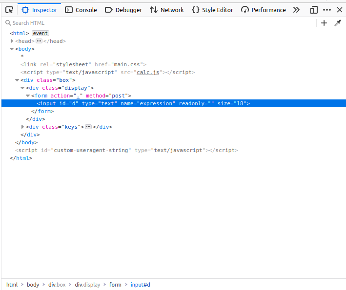
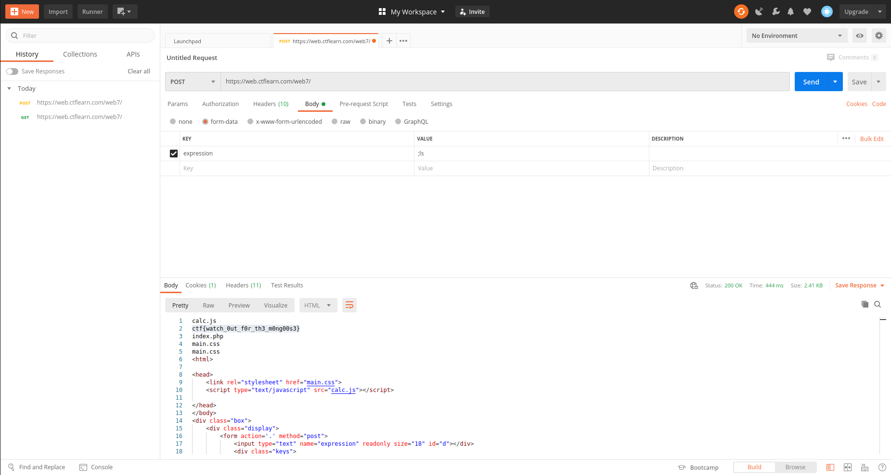

## Calculat3 M3
The main idea finding the flag is OWASP top 10.

#### Step-1:
After I visited https://web.ctflearn.com/web7/, the calculator is vulnerable to injection. 

#### Step-2:
After I checked Inspect Element, I got the name of the input tag as `expression`.

Please go through this to understand what is happening below and why:
https://owasp.org/www-community/attacks/Command_Injection

#### Step-3:
So, now I opened [Postman](https://www.postman.com/), and try to change form of Request from `POST` to `GET`.

#### Step-4:
Finally the flag becomes: 
`ctf{watch_0ut_f0r_th3_m0ng00s3}`