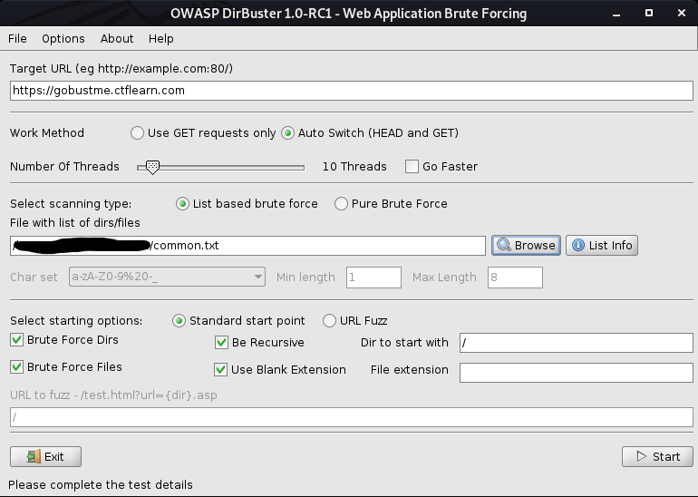
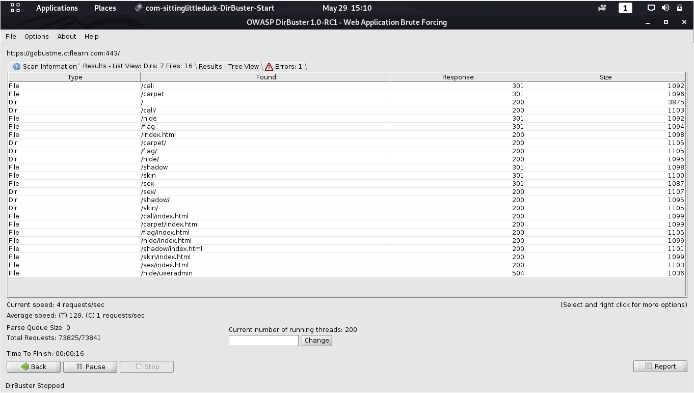

## Gobustme 👻
The main idea is to bruteforce directories and files hidden in a website.

#### Step-1:
We go to the URL https://gobustme.ctflearn.com/ and notice the Ghostbuster theme song, except "Ghostbusters" is replaced with "Gobuster".

#### Step-2:
The site links [Gobuster](https://www.securitynewspaper.com/2019/11/04/bruteforce-any-website-with-gobuster-step-by-step-guide/) which explains what kind of software it is.

#### Step-3:
This is a personal preference but [DirBuster](https://tools.kali.org/web-applications/dirbuster) is a GUI while Gobuster is a CLI which makes DirBuster slightly more beginner friendly.

#### Step-4:
At the bottom of the website, [`common.txt`](./common.txt) is provided. This is a wordlist for possible lists to brute force.

#### Step-5:
Set up DirBuster by configuring it to go to the website and use `common.txt` as the wordlist. If your computer can handle it, check off "Go Faster".

#### Step-6:
After running for a bit, DirBuster will give all the results.

#### Step-7:
We can append these results to the end of the website, eg. for `/call` we'd visit https://gobustme.ctflearn.com/call/

#### Step-8:
Upon visiting `/hide` we see the message "It was well hidden isn't it? CTFlearn{gh0sbu5t3rs_4ever} 👻" which gives us the flag:
`CTFlearn{gh0sbu5t3rs_4ever}`