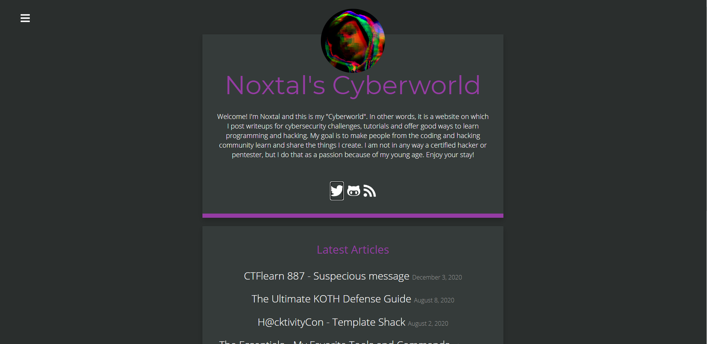
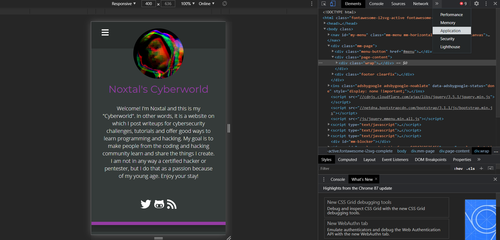
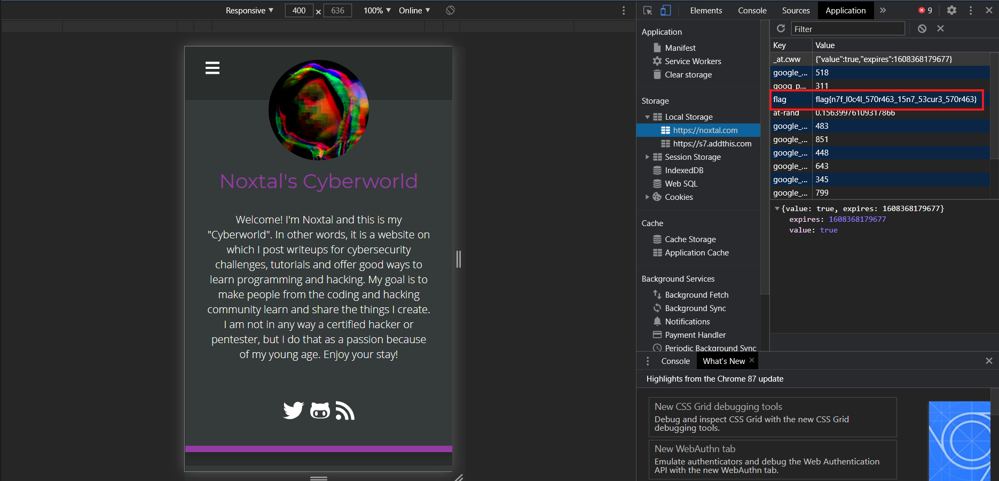

## My Blog
The main idea finding the flag is navigation in Inspect Element.

#### Step-1:

We are given the following message:

Hi, I'm Noxtal! I have hidden a flag somewhere in my [Cyberworld]
(https://noxtal.com/) (AKA blog)... you may find a good 
<strong>application</strong> for your <strong>memory</strong>. ;)

#### Step-2:
So after visiting this website, we are encountered with this webpage:

#### Step-3:
In this message given by author, we can clearly see that it is hinted towards _application_ segment. I am aware that, we have this segment in Inspect Element of the webpage. So I tried that as follows:

#### Step-4:
I found the flag there:

#### Step-5:
Finally the flag becomes:
`flag{n7f_l0c4l_570r463_15n7_53cur3_570r463}`