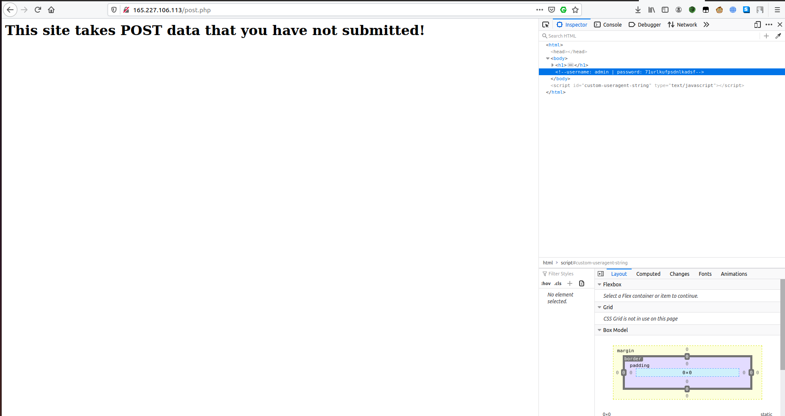

## POST Practice
The main idea finding the flag using different methods of requests like GET & POST.

#### Step-1:
After going to URL http://165.227.106.113/post.php, 

I foremost tried to Inspect Element the page to checkout other dependencies of the page.

I got a credential there:
` username: admin | password: 71urlkufpsdnlkadsf`

#### Step-2:

So here is the idea. I tried to do a POST request to get flag if possible. So I tried with the following command.

```bash
curl -X POST http://165.227.106.113/post.php -d "username=admin&password=71urlkufpsdnlkadsf"
```

#### Step-3:
I got the following output:
```html
<h1>flag{p0st_d4t4_4ll_d4y}</h1>
```

#### Step-4:

Finally the flag becomes:
`flag{p0st_d4t4_4ll_d4y}`
